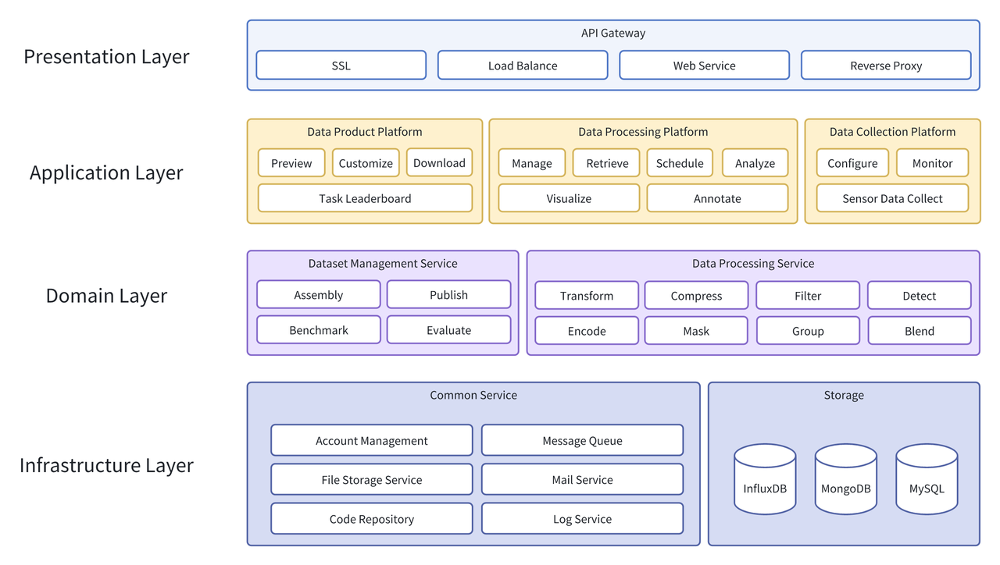
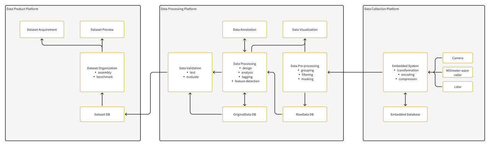
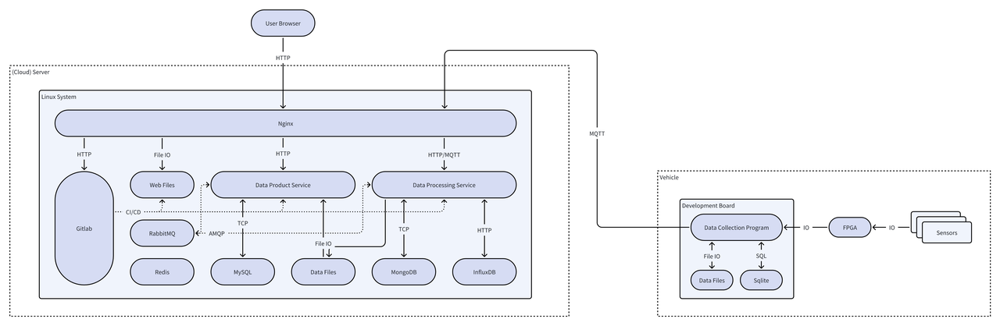
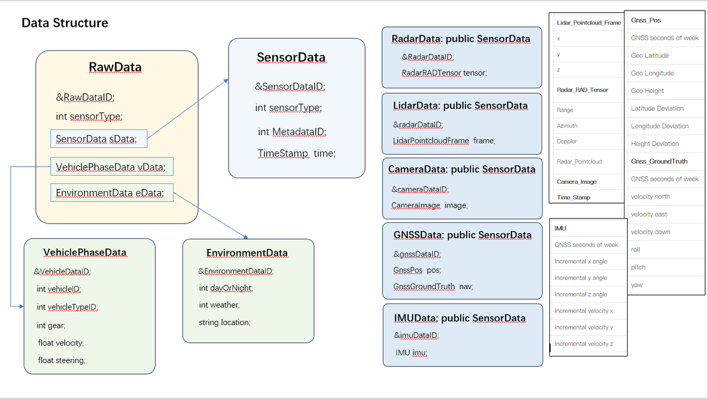
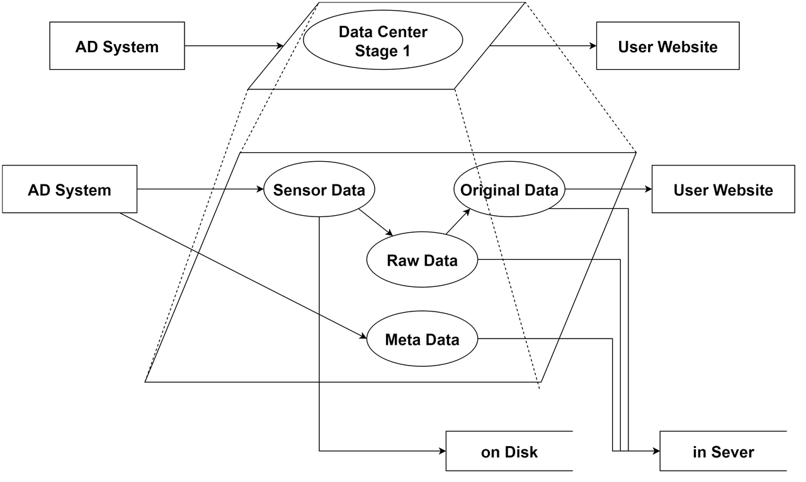
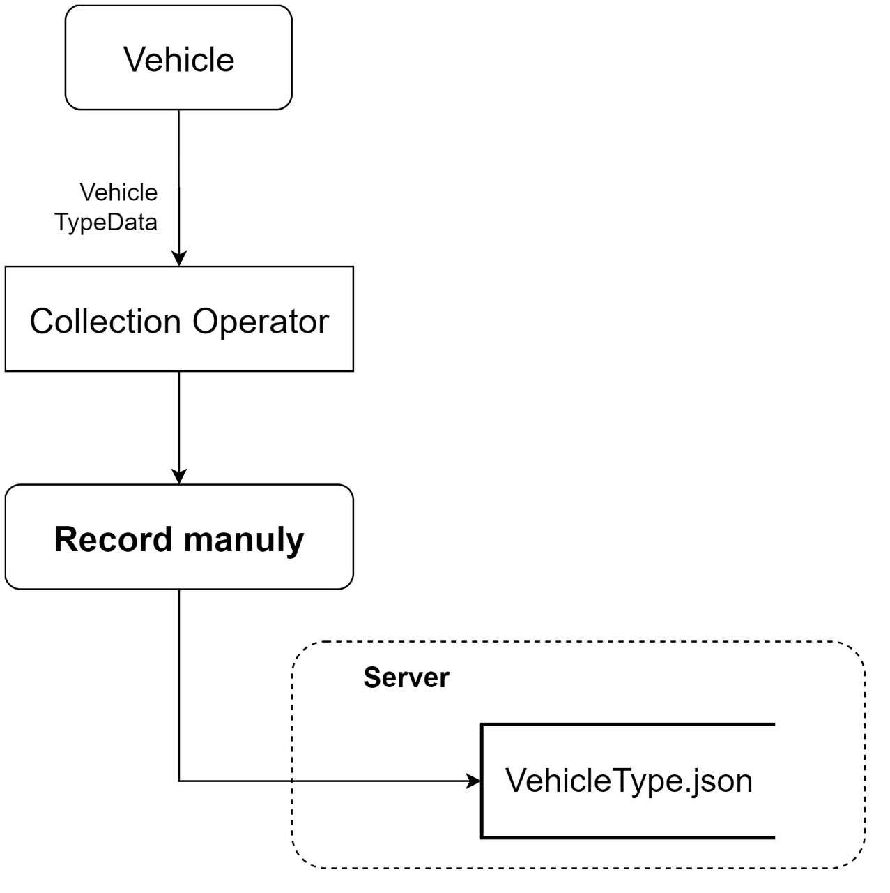
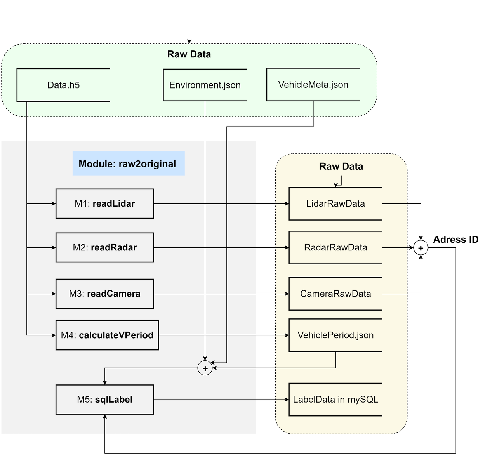

Cloud Data Center
===================

Overview
--------

System Architecture
~~~~~~~~~~~~~~~~~~~

The Cloud Data Center architecture is organized into four primary layers: **Presentation Layer**, **Application Layer**, **Domain Layer**, and **Infrastructure Layer**. Each layer serves distinct functions and contains specific services essential for the overall system's operation.

**The Presentation Layer** is responsible for handling interactions between the cloud system and its users. We assume there are two types of users, the project maintainers and the project contributors. The Presentation Layer provides a user interface for project maintainers to manage their projects and for project contributors to access and contribute to the projects. The Presentation Layer also provides an interface for the system administrators to monitor and manage the system.
and customers who use this system. The Presentation Layer is implemented as a web application that can be accessed through a web browser.

**The Application Layer** contains platforms and services that support operations, includes Data Product Platform and Data Processing Platform. 

**Data Product Platform**  aims at customers who can select datasets and downloads datasets, which enhancing the experience by providing ai-based search mathods and a variety of usecases for customers to choose. 

**Data Processing Platform** is especially designed for project maintainers to process data, which includes data cleaning, data transformation, data integration, data analysis, and data visualization.

**Data Collection Platform** is designed for engineers who collects data. Offering preprocessing modules likje sensor configuration, data monitoring, data collection, and data storage and compress data structure.

When it comes to **Domain Layer**, where key algorithm and technologies are implemented. The Domain Layer contains the core logic of the system, including data Assenbly, Publish, Benchmark, Evaulate of Data Management Sevices, simultaneously, with Tranform, Compress, Filtering, Encoding, Mask, Grouping and Slicing of Dataset Processing Services.

**The Infrastructure Layer** is responsible for managing the system's hardware and software resources. The Infrastructure Layer includes the following components: Compute, Storage, and Network. Network is now locally distributed network with only a website universally accessible. The whole toolchain include MongoDB and MQTT protocol for data storage and transmission. NAS for data storage and processing. A website is deployed on computing server using React and Flask.

Dataflow
~~~~~~~~

Commponents
~~~~~~~~~~~

Data Structure
--------------
The Data Strucutruefor Cloud Data Center is rather important because the bandwidth for data transmission is limited. In order to satisfy online preview and labeling information, 
it is necessary to compress the data structure. The data structure is designed as follows:

We classify the sensor data with **RadarData,  LidarData, CameraData, LidarData** and **GNSSData**. Each data will be designed suitable for online preview and processing, it is more efficient than compressing raw data. 

Data Process Pipeline
---------------------
The diagram below illustrates the data flow between an Autonomous Driving (AD) System, a Data Center, and a User Website.

   Data flow for Data Processing after data collection.

The diagram depicts several key components:

- **AD System**: This symbolizes the autonomous driving systems that collect various types of data from the vehicle's operation.

- **Data Center Stage 1**: The initial stage of the data center where data is first received and processed.

- **User Website**: Represents the interface for users to access processed data or system insights.

- **Sensor Data**: Data directly collected from the AD system's sensors. This is typically the raw, unprocessed data gathered from vehicle sensors.

- **Original Data**: The primary dataset that flows into the processing stage in the data center, before any substantial processing like aggregation or cleaning.

- **Raw Data**: A more refined set of data that has been formatted or cleaned for better usability but still maintains its raw characteristics.

- **Meta Data**: Information about the data itself, which might include details on how, when, and from where the data was collected.

The diagram also shows:

- **On Disk**: Indicates where the data is stored in a physical medium, likely for persistence and backup purposes.

- **In Server**: Denotes that the data is in active use or processing within servers, which could be part of real-time systems or for immediate access and analytics.

Understanding this flow is crucial for grasping how autonomous driving systems manage the substantial quantities of data they generate, store, and process.

   Data flow for Car Data Collection.

    Dataset Processing Pipeline. 

Software Design
---------------

.. autosummary::
   :toctree: generated

   Cloud Data Center